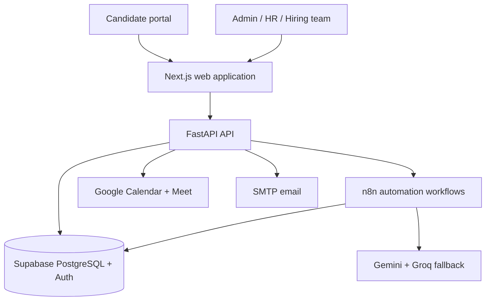
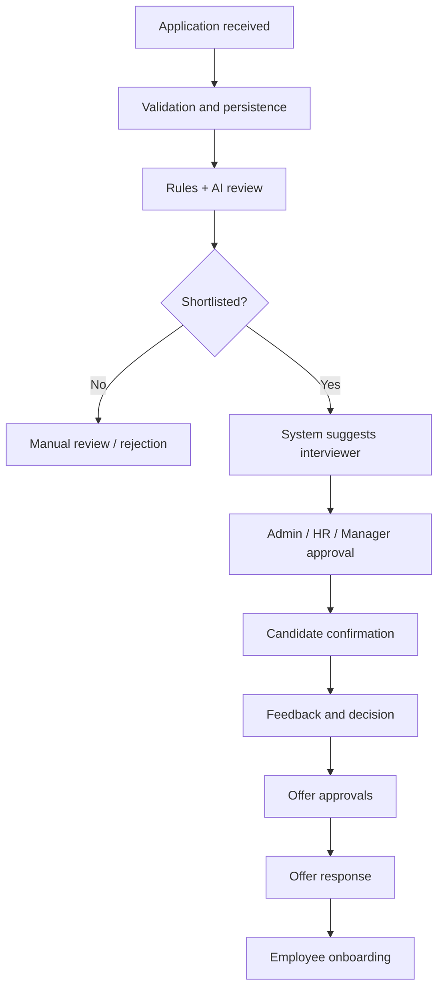

# NovaTech Solutions Recruitment Platform

A full-stack recruitment automation platform for publishing jobs, processing applications, AI-assisted screening, interviewer assignment and approval, interviews, offers, onboarding, operational reporting and workflow recovery.

> AI recommendations support the hiring team; they never replace a human hiring decision.

## Architecture





## Main capabilities

- Responsive public company, careers, job-detail and application pages.
- Job-specific applications with consent, validation and duplicate-event protection.
- Private PDF/DOCX CV upload with hidden-text and prompt-injection screening.
- Username/email authentication, OTP password recovery and temporary-password enforcement.
- Persistent account menu, profile settings, avatar URL, timezone and password change.
- Role-specific navigation and dashboards; candidates never receive staff menus and interviewers only receive assigned/approved candidate access.
- Shared staff demo login with in-menu persona switching, per-persona audit identity and notification badges.
- Secure candidate self-registration by verified application email with a candidate-chosen username and password.
- Admin staff creation, activation/deactivation and role-based API authorization.
- Roles for Admin, HR, Recruiter, Hiring Manager, Interviewer, Operator, Candidate and Employee.
- Departments, designations, multiple-role foundation and interviewer profiles.
- Searchable application list, candidate details, CV link, AI summary, status timeline and private notes.
- Automatic interviewer suggestion based on department and active workload.
- Admin/HR/Hiring Manager approval, replacement, self-assignment and schedule editing.
- Assigned-interviewer workspace with private CV download, evidence review, exact scheduling and structured scorecards.
- Upcoming/past interview views and a dedicated HR/Hiring Manager/Admin hiring-decision queue.
- Dual human approval with audited approve, reject, second-interview and return-to-review actions, also available from the candidate detail screen.
- Google Calendar event and unique Meet creation, branded invitations, 30-minute/start-time reminders and in-app alerts.
- Name-based ready-for-offer selection (no manual application UUID), employment terms, approval, PDF delivery and candidate response.
- Accepted offers automatically activate the employee role, create an employee record/tasks and send secure account/onboarding instructions.
- Employee creation, onboarding tasks and overdue monitoring.
- Branded candidate email templates and delivery-log schema.
- Immediate branded application-received email with the position and application reference, followed by status-specific emails.
- Audit logs, notifications, automation logs, retry queue and daily operational reporting.
- Gemini primary route with Groq `openai/gpt-oss-20b` fallback in WF-03.

## Repository layout

| Path | Purpose |
|---|---|
| `frontend/` | Next.js public portal and authenticated dashboards |
| `backend/` | FastAPI service, authorization and integrations |
| `database/` | Ordered Supabase SQL migrations |
| `workflows/` | 15 importable n8n workflow JSON exports |
| `.github/workflows/ci.yml` | Automated validation |
| `start.bat`, `start.sh` | Local launch helpers |

Generated folders such as `.venv`, `node_modules`, `.next`, caches and local secrets are intentionally excluded from Git.

## Requirements

- Python 3.12+
- Node.js 22.12 or newer (Node 24 is supported)
- Supabase project
- n8n instance
- Gmail App Password or another SMTP account
- Gemini and/or Groq API credentials

## Environment setup

Copy `.env.example` to `.env` and fill the values. Never commit `.env`.

Important groups include:

- Supabase URL, publishable key, service-role secret and database password
- n8n base/webhook URL, encryption key and webhook secret
- Gemini/Groq credentials and model names
- SMTP host, port, username, app password and sender address
- OTP pepper, expiry, Turnstile and allowed frontend origins

Gmail App Passwords may be displayed with spaces; store them without spaces.

The default Gemini model placeholder is `gemini-3.6-flash`; change `GEMINI_MODEL` only if the model enabled for your Google AI account uses a different identifier.

## Database migration order

If the database already has migrations `001` through `022`, run only `database/023_hiring_decisions_and_employee_activation.sql`.

For a fresh database, run numbered migrations in ascending order. Migration `003_seed_test_data_v2.sql` is optional development data and must not be run in production. Obsolete duplicate versions of migrations 002 and 003 have been removed, so every included SQL file has one clear purpose.

Migration 008 adds organization data, user roles, interviewer profiles, automatic interviewer suggestion, assignment approvals, internal notes, notifications and audit logs. Migration 009 adds editable branded email templates and delivery logs. Migration 010 adds granular permissions, requisitions, configurable pipelines, hiring teams, interviewer availability, panel scorecards, documents, communications, invitations, privacy requests and notification preferences. Migration 011 creates private storage buckets and policies, analytics views, production indexes and last-administrator protection. Migration 012 adds distributed session revocation records and privacy-safe login history. Migration 013 completes staff invitation metadata used by the backend and `/invite` acceptance page. Migration 014 adds candidate-document storage policies and verification indexes. Migration 015 adds database-level prevention of overlapping active interviews. Migration 016 stores durable profile-image paths alongside signed display URLs. Migration 017 adds private offer-letter PDF storage. Migration 018 records final production extension metadata. Migration 019 adds CV security metadata and assessments. Migration 020 adds evidence-review metadata, indexes and department-specific shared staff personas.

Migration 021 stores Google Calendar event metadata, Meet codes, schedule timezone, candidate portal invitation state, delivery timestamps and reminder claims. Migration 022 adds secure candidate confirmation/reschedule decisions, 24-hour reminder claims, strict department-based assignment, legacy-admin assignment cleanup and assignment-table synchronization.

Migration 023 adds complete scorecard columns, the human hiring-decision/dual-approval queue, offer employment metadata and employee activation metadata. After running it, restart the backend so PostgREST and the application both use the refreshed schema.

## Google Calendar and Meet setup

Create a Google Cloud OAuth web client, enable the Google Calendar API and authorize the `https://www.googleapis.com/auth/calendar.events` scope with offline access. Add the resulting values to `.env`:

```env
GOOGLE_CALENDAR_CLIENT_ID=
GOOGLE_CALENDAR_CLIENT_SECRET=
GOOGLE_CALENDAR_REFRESH_TOKEN=
GOOGLE_CALENDAR_ID=primary
INTERVIEW_REMINDER_MINUTES=30
INTERVIEW_DAY_REMINDER_HOURS=24
```

To generate the refresh token without editing application code, add `http://localhost:8765/callback` to the OAuth client's authorized redirect URIs and run from the activated backend environment:

```powershell
cd backend
$env:PYTHONPATH="."
python scripts\google_calendar_oauth_setup.py
```

Authorize the Google account that owns the recruitment calendar, copy the returned value into `GOOGLE_CALENDAR_REFRESH_TOKEN`, and restart the backend. The helper never edits `.env` and does not save the token.

The backend creates a fresh Google Meet conference for every scheduled interview, adds the candidate and interviewer as attendees, stores the Calendar event/Meet metadata, sends branded SMTP messages, and issues in-app reminders. Google Meet normally uses the meeting link/code rather than a separate password.

## Local installation

### Windows automatic start

From File Explorer, double-click `start.bat`. It installs missing dependencies and opens separate backend/frontend terminals.

### Manual PowerShell setup

```powershell
cd E:\codexifyr-novatech-solutions\backend
py -m venv .venv
.\.venv\Scripts\Activate.ps1
pip install -r requirements.txt
python main.py
```

In a second terminal:

```powershell
cd E:\codexifyr-novatech-solutions\frontend
npm install
npm run dev
```

Open `http://localhost:3000`. API health is available at `http://localhost:8000/health` and local API docs at `http://localhost:8000/api/docs`.

## Initial administrator

Set the `INITIAL_ADMIN_*` variables locally, then run once:

```powershell
cd backend
$env:PYTHONPATH="."
python scripts\create_initial_users.py
```

After creation, remove/blank the initial password value. Future HR, recruiter, manager and interviewer accounts should be created from **Dashboard → Users** rather than by rerunning the script.

### Optional shared staff demonstration login

After migration 020, add `SHARED_STAFF_LOGIN_ENABLED=true` to `.env`, then run once:

```powershell
cd backend
$env:PYTHONPATH="."
python scripts\create_shared_staff_login.py
```

Sign in with username `staff` and password `Staff@234`, then choose an HR, recruiter, hiring-manager, interviewer or operator profile. This is intended for a controlled demo/testing environment. Production should keep the flag disabled and use individual accounts.

## Staff and interviewer flow

1. Admin creates a staff account and assigns a role.
2. The user changes the temporary password at first login.
3. The backend creates an interview for a shortlisted application (WF-04 remains compatible and duplicate-safe).
4. The database proposes an available interviewer from the job department, then its Hiring Manager, then HR as fallback. Admin, recruiter and operator accounts are never assigned.
5. Admin, HR or Hiring Manager approves or replaces the proposal.
6. The approver may assign themselves if they will conduct the interview.
7. The approved interviewer opens the candidate workspace and selects the exact date/time.
8. The backend creates Google Calendar/Meet, sends structured invitations and starts 24-hour, configured pre-start and start-time reminders.
9. The candidate confirms from the secure email link or requests another time. The assigned interviewer, HR or Hiring Manager can accept/reject; administrators retain oversight. Acceptance updates the existing Calendar event and sends revised invitations.
10. Candidate portal registration uses the original application email plus OTP verification.
11. Every assignment, schedule, reschedule decision and scorecard action is recorded in the audit log.
12. A submitted scorecard creates a pending human decision. Hiring Manager and HR approve separately (Admin may make an audited final override), after which the candidate appears by name on the Offers page.
13. Offer acceptance creates onboarding records and upgrades the candidate account to the approved employee role/title without allowing the candidate to choose privileged permissions.

## n8n setup

Existing installations do not need to re-import or modify workflows. All advanced features are implemented through the application and database compatibility layer. For a fresh n8n installation, import all JSON files from `workflows/`.

1. Import all JSON files from `workflows/` only on a fresh installation.
2. Configure Supabase, Gmail, Gemini and Groq credentials inside n8n.
3. Update Execute Workflow nodes if imported workflow IDs changed.
4. Set production webhook URLs and the shared webhook secret.
5. Activate the workflows only after credentials and child-workflow references are valid.
6. Test the complete path from application to onboarding.

The backend and n8n may use different Groq API keys. Both keys must belong to valid accounts and remain outside Git.

## Workflow catalogue

| Workflow | Responsibility |
|---|---|
| WF-01 | Application intake and validation |
| WF-02 | Candidate/application persistence |
| WF-03 | Rules, AI review and fallback routing |
| WF-04 | Interview record creation |
| WF-04B/C/D/E | Confirmation, rescheduling, reminders, feedback and selection |
| WF-05/05B/05C | Offer creation, approvals, delivery and response |
| WF-06/06B | Employee onboarding and task tracking |
| WF-07 | Error capture, retry queue and replay |
| WF-08 | Daily reporting and dashboard metrics |

## Security model

- Secrets are ignored by Git and must be deployment environment variables.
- Backend role checks protect staff endpoints; hiding UI links is not treated as authorization.
- Supabase RLS protects public and authenticated access while server operations use the service role.
- OTPs are hashed, expire, have attempt limits and use generic responses to reduce account enumeration.
- Login/application endpoints have rate limits and security headers.
- Candidate-facing emails exclude AI reasoning, internal notes and private scores.
- CV files are type/signature checked, size-limited, stored privately and opened through short-lived signed URLs.
- PDF/DOCX text is extracted deterministically. White, hidden, tiny or off-page text is excluded from AI input.
- Scores come from visible CV evidence, not self-entered form skills. A clean score of 80 or above is shortlisted; every lower score, mismatch, suspicious file or unreadable file is routed to human review instead of automatic rejection.
- Instruction-like CV content cannot auto-shortlist a candidate: suspicious or unreadable CVs bypass n8n scoring and enter `MANUAL_REVIEW` for a human decision.
- Sensitive actions create audit records.
- Do not expose service-role keys, n8n encryption keys, SMTP passwords or OTP peppers in frontend variables.

Browser sessions use HttpOnly cookies with a separate CSRF cookie for state-changing requests. Bearer tokens remain in the login response for backward compatibility during client migration; the frontend does not persist them. The current rate limiter is an in-memory development fallback; use a shared store such as Redis for multiple backend instances.

## Testing

```powershell
cd frontend
npm run build
npm run typecheck

cd ..\backend
python -m compileall app scripts
pytest

pytest tests/test_integrations_mocked.py

cd scripts
python live_integrations.py
# Optional non-destructive network checks:
python live_integrations.py --network
```

Frontend tests:

```powershell
cd frontend
npm test

npm run test:e2e
```

The integration test suite is mocked and does not claim live Supabase, SMTP, AI, or n8n success. The live script reads the existing environment configuration, reports only provider configuration/status, and never prints secrets or response bodies.

Browser tests use mocked API responses and skip unless `E2E_BASE_URL` is set. Run them against a running frontend with `E2E_BASE_URL=http://localhost:3000 npm run test:e2e`. Test records use synthetic `E2E` identifiers and never log response bodies or credentials.

## Dependency audit

The frontend uses Next.js 16, React 19 and Vitest 5 on Node.js 22.12+. The lockfile is generated without `--force` or legacy-peer workarounds. Run `npm audit` in the target environment as part of every release because registry advisories can change over time.

## Verification status

- Python application and provisioning scripts pass bytecode compilation.
- Next.js production build and TypeScript validation pass for all public, staff, interviewer and candidate routes.
- Deterministic CV security tests cover clean files, white/invisible PDF and DOCX prompts, and visible prompt injection.
- Mocked integration tests cover Supabase, structured SMTP actions, Gemini/Groq fallback, n8n signing, Calendar event creation/update and analytics PDF generation.
- Playwright specifications cover authentication, role navigation, applications, assignment approval, interviewer Google Meet scheduling, secure candidate rescheduling, candidate offers, profile photos and candidate documents.
- Live Supabase, SMTP, Google, AI and n8n calls are intentionally not part of offline build verification; run `live_integrations.py --network` and the final acceptance test in the target environment.
- No API keys, webhook secrets or tokens are printed by ordinary health/build tooling.

Final manual acceptance test:

1. Publish a job and submit an application.
2. Verify persistence, rule score and AI review.
3. Verify automatic interviewer proposal and human approval/change.
4. Confirm/reschedule the interview and submit feedback.
5. Approve, deliver and accept an offer.
6. Confirm employee/onboarding creation.
7. Verify reminder, error-retry and reporting workflows.

## Free-tier deployment

- Frontend: Vercel free tier
- Backend: Render free web service (cold starts may occur)
- Database/Auth/Storage: Supabase free tier
- Workflows: self-host n8n on an eligible free hosting option; n8n Cloud trials expire
- Source control/CI: GitHub

Set production CORS origins, API URL and secrets on the hosting platforms. Do not upload the local `.env` file.

## Operational notes

- Database migrations must be backed up and tested before production execution.
- Keep separate development and production Supabase/n8n environments.
- Review failed automation items before replaying them.
- Configure retention/privacy rules before storing real candidate documents.
- Scheduled n8n workflows require an always-available n8n host.

## License

Private project. Add an explicit license before public redistribution.
